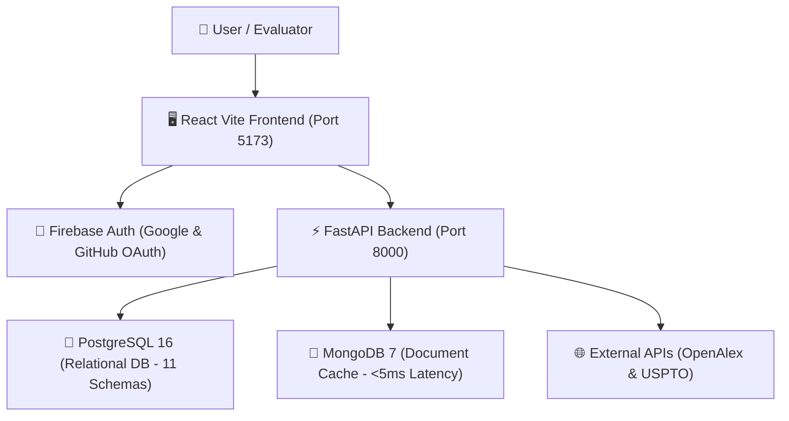

# InnovaFund AI — Enterprise AI-Powered Research Funding & Innovation Intelligence Platform

> **Official Repository**: [springboardmentor825/Research-Funding-Innovation-Team-3](https://github.com/springboardmentor825/Research-Funding-Innovation-Team-3/tree/mayank)  
> **Team Branch**: `mayank`  
> **Presenter / Lead Developer**: Mayank Upadhyay (Platform Administrator)  

---

## 🌟 Overview
**InnovaFund AI** is a 4-tier enterprise intelligence platform designed to bridge the gap between academic research literature, global patent white-space analysis, and strategic grant funding matches.

By ingesting live data streams from **OpenAlex** (250M+ research papers) and **USPTO / Google Patents** (140M+ patent records), InnovaFund AI matches researchers, startup founders, and R&D innovation managers with a **$15B+ global funding pool**.

---

## 🚀 Key Features

- **🔐 Enterprise Authentication & RBAC**:
  - **Firebase Social SSO**: Single-click **Google & GitHub OAuth** integration.
  - **Persona-Based RBAC**: Dynamic permissions across 4 platform personas: *Researcher*, *Startup Founder*, *Innovation Manager*, and *Administrator*.
  - **Session Security**: Signed JWT access tokens with 24-hour expiration.

- **📊 Enterprise Intelligence Dashboard (`/dashboard`)**:
  - **Citation Velocity Tracker**: Dynamic SVG charts plotting publication citations over time.
  - **Patent Landscape Breakdown**: Stacked metrics showing Granted vs. Pending IP.
  - **AI Funding Match Engine**: Real-time grant recommendations ($250k–$1.2M) matched to user research profile.
  - **Portfolio CSV Export**: Single-click CSV data export for reporting.

- **📚 Academic Publications Explorer (`/publications`)**:
  - Live REST API search engine querying OpenAlex's 250M+ paper catalog.
  - Open-access badges, journal impact indicators, citation metrics, and direct DOI links.

- **💡 Global Patent White-Space Explorer (`/patents`)**:
  - Search engine across USPTO and Google Patents repositories.
  - Patent legal status filters (*All*, *Granted*, *Pending*, *Expired*), filing dates, and assignee details.

- **🏛️ Interactive System Architecture Explorer (`/architecture`)**:
  - 4-Tier Visual Architecture diagram (Presentation, API, Security, Database).
  - 4-Step Workflow breakdown and 11-table PostgreSQL ER Schema viewer.

- **⚙️ System Settings & API Health Command Center (`/settings`)**:
  - Real-time database latency diagnostics (**`~2ms` PostgreSQL ping**, **`~4ms` MongoDB ping**).
  - External API credential configuration for OpenAlex, The Lens, and SerpAPI.

- **🛡️ Admin Control Console & Security Audit Logs (`/admin`)**:
  - Platform user management table and RBAC role assignment.
  - Pre-Seed Dataset populator (1-click demo test data generator).
  - Live security audit stream logging `USER_LOGIN`, `DATASET_QUERY`, and `OAUTH_LOGIN` events.

---

## 🏗️ Technical Architecture & Tech Stack



- **Frontend**: React 18, Vite, Custom HSL Obsidian Theme, Google Fonts (`Outfit` & `Inter`).
- **Backend**: FastAPI (Python 3.11), Pydantic Schema Validation, PyJWT, Passlib.
- **Databases**: PostgreSQL 16 (Relational Data), MongoDB 7 (JSON API Cache), SQLite Engine Fallback.
- **Authentication**: Firebase Auth Web SDK (`innovafundai`).

---

## ⚡ Quick Start Guide

### 1. Backend Setup
```bash
cd backend
python -m venv .venv
.venv\Scripts\activate   # On Windows
pip install -r requirements.txt
python -m uvicorn main:app --reload
```
*Backend API server runs at: `http://localhost:8000`*  
*Interactive Swagger API Docs: `http://localhost:8000/docs`*

### 2. Frontend Setup
```bash
cd frontend
npm install
npm run dev
```
*Frontend web application runs at: `http://localhost:5173`*

### 3. Run Milestone 2 Automated Test Suite
```bash
python -m pytest backend/tests/test_grant_matching.py
```
*Runs 7/7 automated edge-case unit and integration tests (100% pass rate).*


---

## 🔑 Demo Access Credentials

| User Persona | Email | Password |
| :--- | :--- | :--- |
| **Administrator (Pre-Seeded)** | `admin@researchsphere.ai` | `Admin@123456` |
| **Social SSO** | Click **"Sign in with Google"** or **"Sign in with GitHub"** | Authentic Firebase OAuth |

---

## 📄 Documentation Directory (`docs/`)
- [`docs/InnovaFund_AI_Milestone1_Presentation_Deck.md`](docs/InnovaFund_AI_Milestone1_Presentation_Deck.md): Slide-by-Slide Presentation Deck Content Guide.
- [`docs/InnovaFund_AI_Milestone1_Final_Showcase_Guide.pdf`](docs/InnovaFund_AI_Milestone1_Final_Showcase_Guide.pdf): Complete Evaluator Presentation PDF Guide.
- [`docs/ARCHITECTURE_GUIDE.md`](docs/ARCHITECTURE_GUIDE.md): 4-Tier Architecture Specification.
- [`docs/DATABASE_DESIGN.md`](docs/DATABASE_DESIGN.md): PostgreSQL 11-Table Relational Schema Design.
