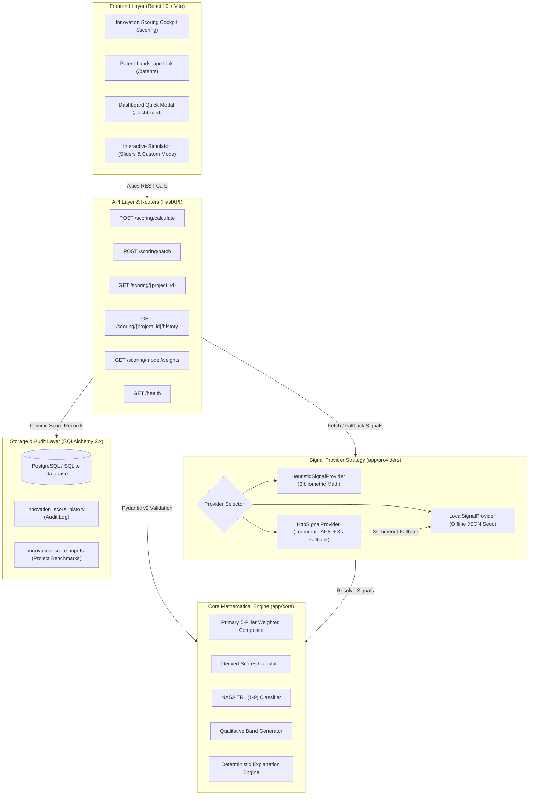
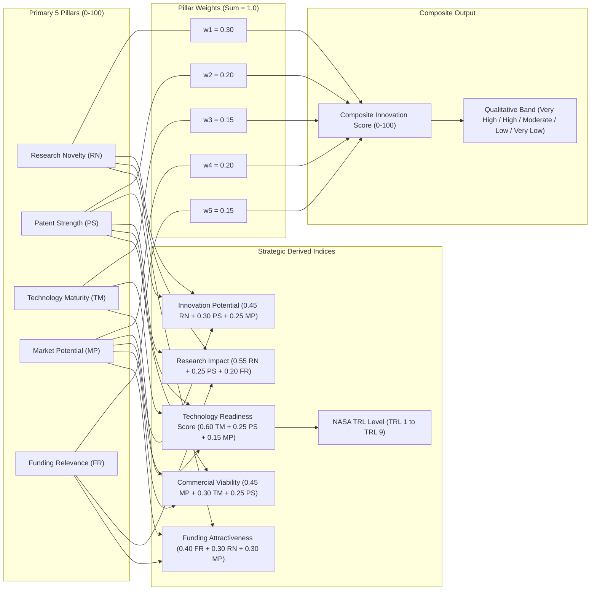
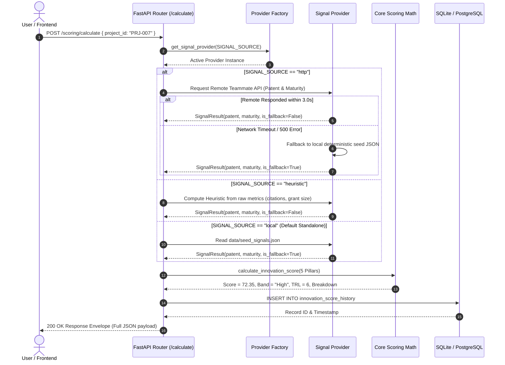
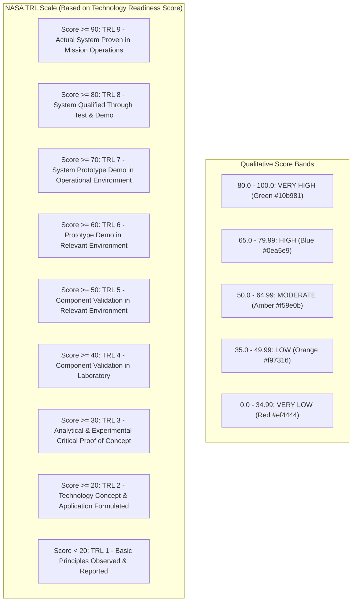
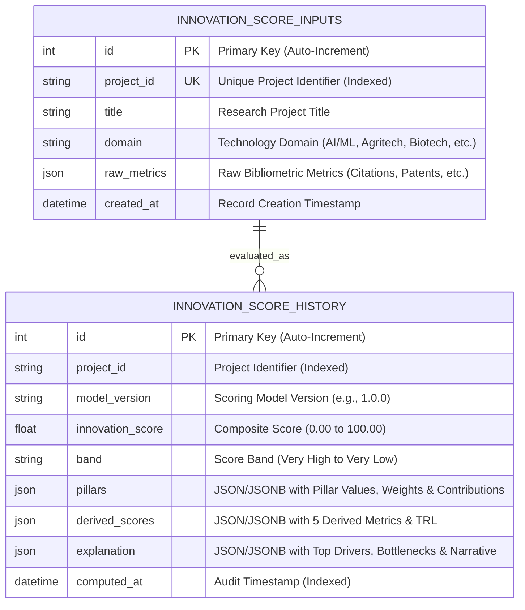

# System Architecture & Technical Documentation
## Member 4: Standalone Innovation Scoring Engine & Platform Integration
**Milestone 3 — Research Funding & Innovation Intelligence Platform**

---

## 1. System Overview & Architecture

The Innovation Scoring Engine operates both as an **autonomous microservice** and as an **integrated subsystem** within the platform. The architecture separates the pure mathematical scoring domain from network I/O, persistence, and UI presentation.

### High-Level Multi-Tier Architecture Diagram

---

## 2. Mathematical 5-Pillar Scoring Flow & Derived Dimensions

The core scoring engine takes 5 primary normalized pillars in the $[0, 100]$ range, computes the composite score using single-source-of-truth weights ($\sum = 1.0$), evaluates 5 derived strategic indices, and maps technology maturity to the NASA TRL (1–9) scale.

### Scoring Flowchart & Weight Distribution

---

## 3. Signal Provider Strategy & Resilience Hierarchy

To ensure **zero external dependency**, the scoring engine employs a Strategy Pattern. External signals (Patent Strength & Technology Maturity) are resolved through a resilient fallback hierarchy:

---

## 4. NASA Technology Readiness Level (TRL) & Band Mapping

---

## 5. Database Entity Relationship (ER) Model

---

## 6. End-to-End Execution & Testing Matrix

| Component / Layer | Implementation File | Test File | Verification Result |
| :--- | :--- | :--- | :--- |
| **Mathematical Weights** | `app/core/weights.py` | `tests/test_weights.py` | ✅ $\sum = 1.0$ validated; exception raised on invalid sums |
| **Composite Scoring Math** | `app/core/scoring.py` | `tests/test_scoring_math.py` | ✅ Exact `72.35` fixture precision; min/max boundary checks pass |
| **Derived Scores & TRL** | `app/core/scoring.py` | `tests/test_derived_scores.py` | ✅ NASA TRL 1–9 mapping and qualitative bands pass 100% |
| **Signal Providers** | `app/providers/*` | `tests/test_providers.py` | ✅ Deterministic local, heuristic, and HTTP fallback pass |
| **Pydantic Validation** | `app/schemas/scoring.py` | `tests/test_validation.py` | ✅ $0 \le x \le 100$ boundary checks & batch limit $\le 50$ enforced |
| **FastAPI REST Endpoints** | `app/api/routes_scoring.py` | `tests/test_api.py` | ✅ All 6 endpoints pass with 200/404 handling |
| **Database Migrations** | `backend/alembic/` | `scripts/seed_db.py` | ✅ 25 projects seeded; additive tables auto-created |
| **Frontend Workspace** | `frontend/src/pages/ScoringPage.jsx` | `npm run build` | ✅ Zero errors in production bundling (3.63s) |
