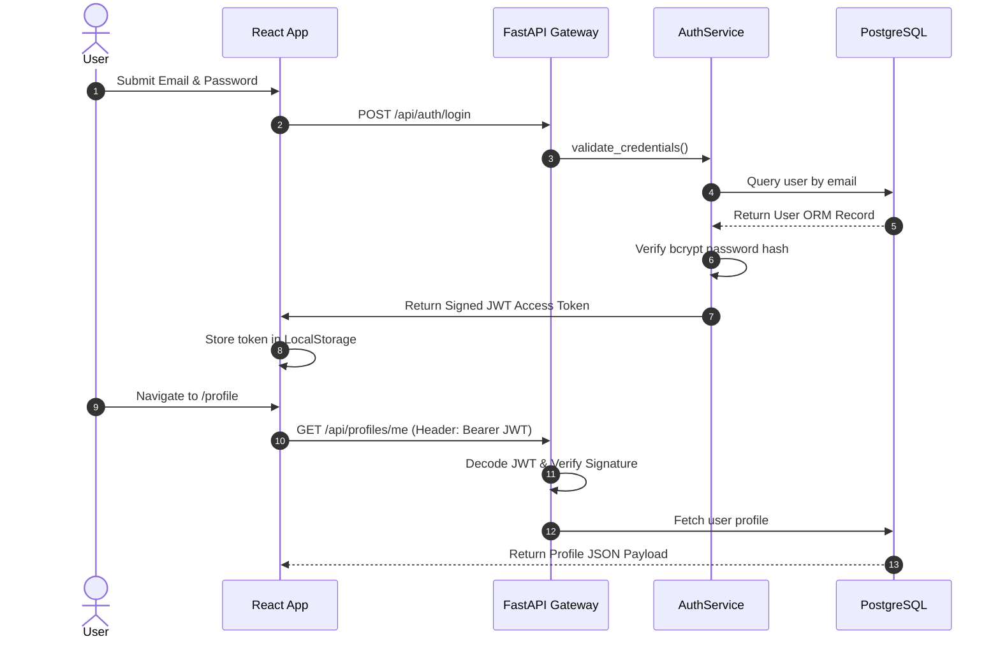

# ResearchSphere AI - Architecture Reference Guide

## 1. System Topology & Layers
ResearchSphere AI follows a clean 4-tier enterprise architecture:

```
[ Client Layer (React / Vite) ]
          │ (HTTP / JSON REST)
[ API & Security Gateway (FastAPI, CORS, JWT Bearer Guard) ]
          │
[ Business Service & Repository Layer (AuthService, ProfileService, DatasetService) ]
          │
[ Persistence Layer (PostgreSQL 16 Relational + MongoDB 7 Raw Payloads) ]
```

---

## 2. Security Boundary & Authentication Lifecycle



---

## 3. Dataset Integration & Caching Pattern
When a user searches for publications or patents:
1. `DatasetService` queries external APIs (`OpenAlex`, `CrossRef`, `Semantic Scholar`, `USPTO`, `Google Patents`, `The Lens`).
2. The raw response payload is cached in **MongoDB** (`raw_publication_payloads` / `raw_patent_payloads`) to avoid hitting external rate limits.
3. The normalized publication/patent entities are converted into Pydantic models and persisted to **PostgreSQL** via `PublicationRepository` / `PatentRepository`.
4. Processed records are returned to the client.

---

## Educational Breakdown

### 1. What was created
- Detailed architectural reference document explaining layer boundaries, authentication flow sequence diagrams, and dataset caching patterns.

### 2. Why it is needed
- Guides senior developers and architects on system design principles, threat vectors, and data caching flows.

### 3. How it works
- Explains how requests move from client UI through JWT auth guards, business service layers, and dual database persistence.

### 4. Which files were added
- [`docs/ARCHITECTURE_GUIDE.md`](file:///c:/Users/mayan/OneDrive/Documents/GitHub/InnovaFund-AI/docs/ARCHITECTURE_GUIDE.md)

### 5. How to run it
- Read alongside `docs/SYSTEM_ARCHITECTURE.md`.

### 6. Industry best practices
- Never store raw un-normalized 3rd-party payloads in relational SQL tables; use document stores like MongoDB for payload caching.

### 7. Common mistakes to avoid
- Passing un-validated user tokens directly to internal database queries.
