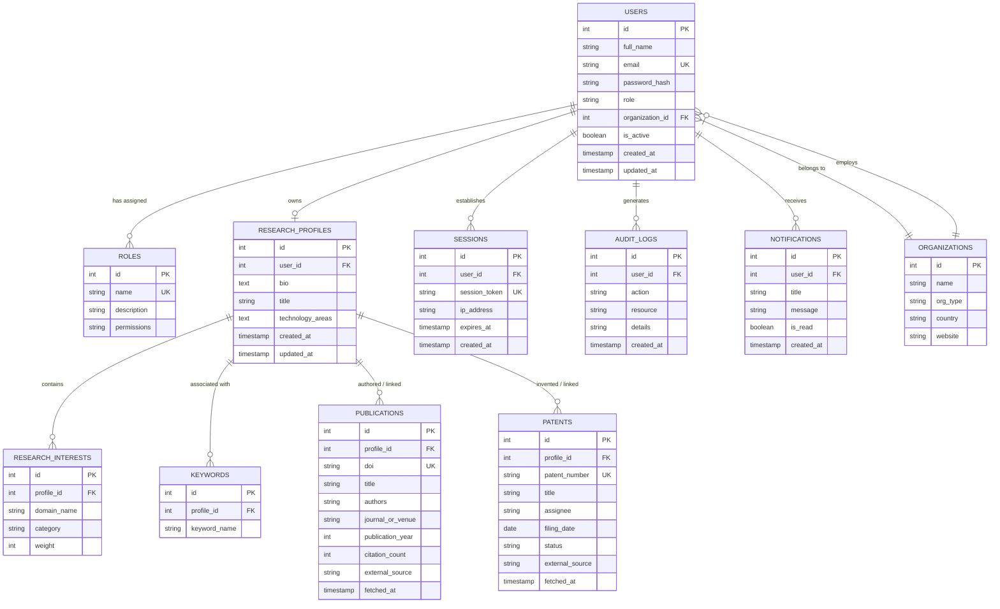

# ResearchSphere AI - Database Design & ER Diagram

## 1. Production ER Diagram (Relational PostgreSQL + MongoDB Hybrid)

---

## 2. Table Specifications & Explanations

### 1. `users` Table
- **Purpose**: Stores platform user accounts, authentication credentials, assigned role, and organizational affiliation.
- **Columns**: `id` (PK), `full_name`, `email` (UNIQUE), `password_hash`, `role`, `organization_id` (FK), `is_active`, `created_at`, `updated_at`.

### 2. `roles` Table
- **Purpose**: Defines RBAC roles (`researcher`, `startup_founder`, `innovation_manager`, `administrator`) and permissions.
- **Columns**: `id` (PK), `name` (UNIQUE), `description`, `permissions`.

### 3. `research_profiles` Table
- **Purpose**: Holds high-level research profiles linked 1-to-1 with a user account.
- **Columns**: `id` (PK), `user_id` (FK -> `users.id`), `bio`, `title`, `technology_areas`, `created_at`, `updated_at`.

### 4. `research_interests` Table
- **Purpose**: Specific research domains and sub-fields associated with a research profile.
- **Columns**: `id` (PK), `profile_id` (FK -> `research_profiles.id`), `domain_name`, `category`, `weight`.

### 5. `publications` Table
- **Purpose**: Scientific paper metadata aggregated from OpenAlex, CrossRef, and Semantic Scholar.
- **Columns**: `id` (PK), `profile_id` (FK), `doi` (UNIQUE), `title`, `authors`, `journal_or_venue`, `publication_year`, `citation_count`, `external_source`, `fetched_at`.

### 6. `patents` Table
- **Purpose**: Patent metadata aggregated from USPTO, Google Patents, and The Lens.
- **Columns**: `id` (PK), `profile_id` (FK), `patent_number` (UNIQUE), `title`, `assignee`, `filing_date`, `status`, `external_source`, `fetched_at`.

### 7. `organizations` Table
- **Purpose**: Academic institutions, universities, startups, and R&D enterprises.
- **Columns**: `id` (PK), `name`, `org_type`, `country`, `website`.

### 8. `keywords` Table
- **Purpose**: Normalized technology and domain tags associated with research profiles.
- **Columns**: `id` (PK), `profile_id` (FK), `keyword_name`.

### 9. `sessions` Table
- **Purpose**: User active login sessions, JWT token tracking, and device IP tracking.
- **Columns**: `id` (PK), `user_id` (FK), `session_token`, `ip_address`, `expires_at`, `created_at`.

### 10. `audit_logs` Table
- **Purpose**: Security auditing and system action traceability.
- **Columns**: `id` (PK), `user_id` (FK), `action`, `resource`, `details`, `created_at`.

### 11. `notifications` Table
- **Purpose**: System and platform alerts delivered to users.
- **Columns**: `id` (PK), `user_id` (FK), `title`, `message`, `is_read`, `created_at`.

---

## 3. MongoDB Collection Design (Secondary Document Store)
- **`raw_publication_payloads`**: Caches original JSON responses from OpenAlex, CrossRef, and Semantic Scholar to minimize outbound external API rate limits.
- **`raw_patent_payloads`**: Caches raw patent JSON responses from Google Patents, USPTO, and The Lens.
- **`audit_events`**: High-frequency JSON event stream for security analytics.

---

## Educational Breakdown

### 1. What was created
- Designed complete production database schemas for 11 relational tables in PostgreSQL alongside secondary document collections in MongoDB, documented with a Mermaid ER diagram.

### 2. Why it is needed
- Relational integrity ensures users, roles, and profiles maintain consistent relationships, while raw API caches in MongoDB prevent rate limits on external data providers.

### 3. How it works
- Foreign key constraints maintain relational cascade rules, while indexes on `email`, `doi`, and `patent_number` optimize lookup speeds.

### 4. Which files were added
- [`docs/DATABASE_DESIGN.md`](file:///c:/Users/mayan/OneDrive/Documents/GitHub/InnovaFund-AI/docs/DATABASE_DESIGN.md)

### 5. How to run it
- Executed via SQLAlchemy ORM models or database migration scripts (`schema.sql` / Alembic).

### 6. Industry best practices
- Index high-cardinality unique lookup fields (`email`, `doi`, `patent_number`); keep foreign keys explicit with `ON DELETE CASCADE` where appropriate.

### 7. Common mistakes to avoid
- Storing un-normalized multi-valued comma-separated lists without proper join tables or array models.
