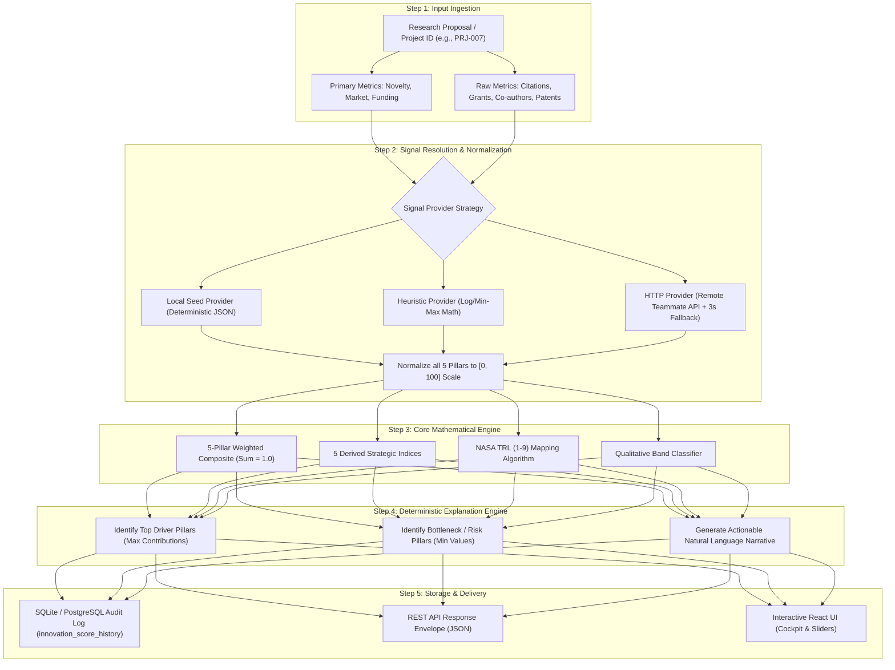
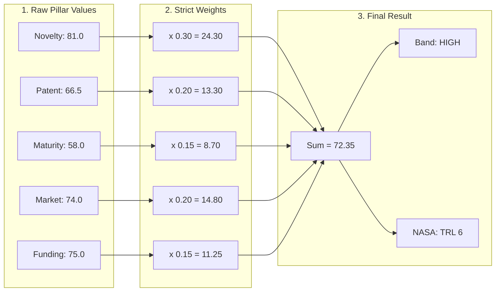
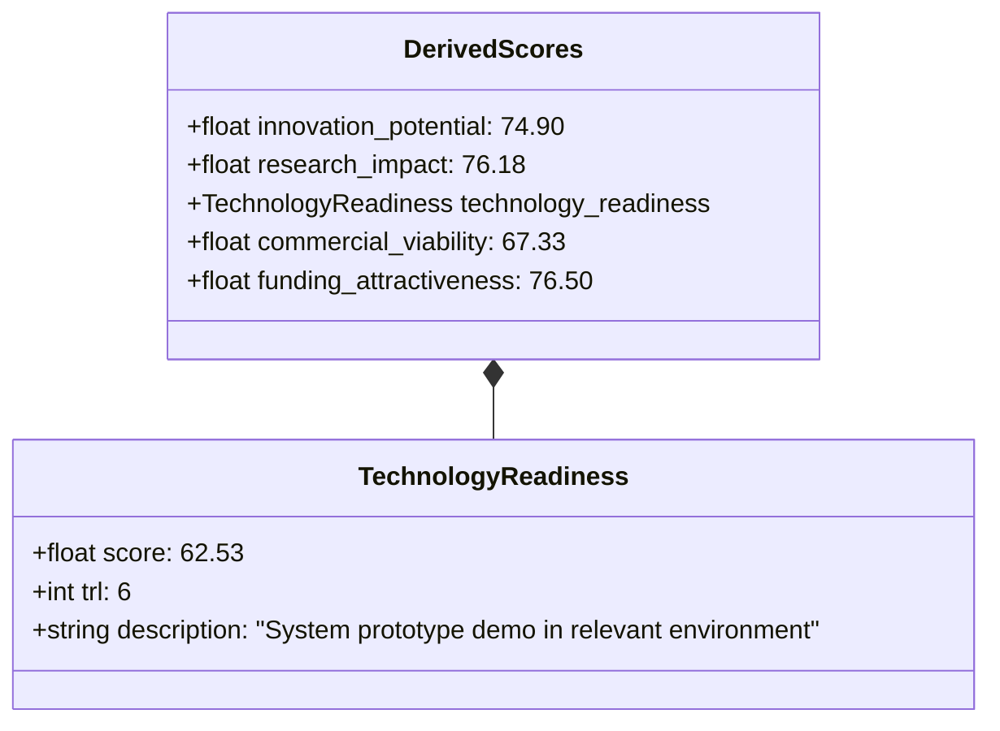
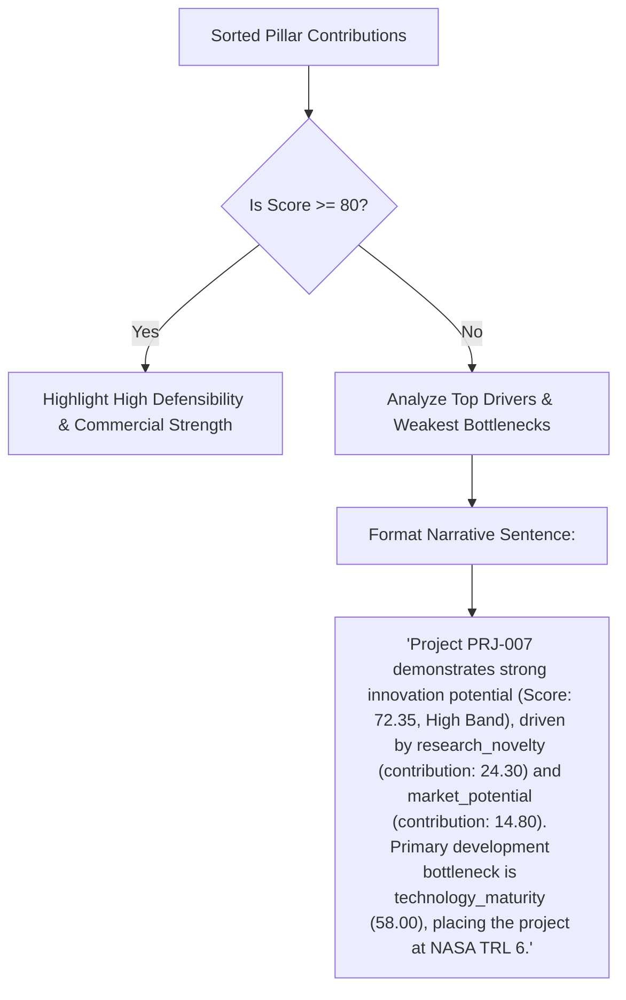

# Member 4: Standalone Innovation Scoring Intelligence Engine
**Milestone 3 — Research Funding & Innovation Intelligence Platform**

---

## 🎯 1. What is Member 4's Role?

Member 4 is the **Innovation Scoring Intelligence Engine**. 

Its job is to take any deep-tech research proposal, evaluate its scientific merit, patentability, readiness, commercial potential, and funding relevance, and produce a **standardized, auditable Innovation Score (0–100)** with **NASA Technology Readiness Levels (TRL 1–9)**, five strategic derived indices, and deterministic narrative explanations.

### 🛡️ Core Principle: 100% Zero-Dependency Standalone Operation
- Can clone, run, test, and demonstrate on a clean computer with **no other teammate's API, database, or code running**.
- Treats external signals (Patent Strength & Technology Maturity) as something it can compute or resolve for itself by default via local deterministic seed datasets or heuristic bibliometric algorithms.

---

## 🧠 2. How the Scoring Intelligence Works (Step-by-Step Pipeline)



---

## 📐 3. The Mathematical Equations & Calculation Flow

### A. Primary 5-Pillar Weighted Composite Formula
$$\text{Innovation Score} = \sum_{i=1}^{5} (w_i \times P_i)$$

$$\text{Innovation Score} = (0.30 \times \text{RN}) + (0.20 \times \text{PS}) + (0.15 \times \text{TM}) + (0.20 \times \text{MP}) + (0.15 \times \text{FR})$$

Where:
- $\text{RN}$ = Research Novelty ($w_1 = 0.30$)
- $\text{PS}$ = Patent Strength ($w_2 = 0.20$)
- $\text{TM}$ = Technology Maturity ($w_3 = 0.15$)
- $\text{MP}$ = Market Potential ($w_4 = 0.20$)
- $\text{FR}$ = Funding Relevance ($w_5 = 0.15$)
- **Constraint**: $w_1 + w_2 + w_3 + w_4 + w_5 = 1.00$ *(Strictly validated on system startup)*

---

### B. Step-by-Step Calculation Example on `PRJ-007` (Agritech Proposal)



1. **Research Novelty Contribution**: $81.0 \times 0.30 = \mathbf{24.30}$
2. **Patent Strength Contribution**: $66.5 \times 0.20 = \mathbf{13.30}$
3. **Technology Maturity Contribution**: $58.0 \times 0.15 = \mathbf{8.70}$
4. **Market Potential Contribution**: $74.0 \times 0.20 = \mathbf{14.80}$
5. **Funding Relevance Contribution**: $75.0 \times 0.15 = \mathbf{11.25}$
6. **Composite Innovation Score**: $24.30 + 13.30 + 8.70 + 14.80 + 11.25 = \mathbf{72.35}$
7. **Qualitative Band**: $\mathbf{72.35 \in [65.0, 79.99]} \rightarrow \mathbf{\text{High}}$

---

## 🔭 4. The 5 Derived Strategic Indices & NASA TRL Scale

In addition to the composite score, the intelligence engine calculates 5 domain-specific indices:



| Derived Metric | Mathematical Formula | PRJ-007 Result | Strategic Meaning |
| :--- | :--- | :--- | :--- |
| **Innovation Potential** | $0.45 \cdot \text{RN} + 0.30 \cdot \text{PS} + 0.25 \cdot \text{MP}$ | **74.90** | Evaluates long-term disruptive capacity |
| **Research Impact** | $0.55 \cdot \text{RN} + 0.25 \cdot \text{PS} + 0.20 \cdot \text{FR}$ | **76.18** | Academic and foundational scientific value |
| **Technology Readiness** | $0.60 \cdot \text{TM} + 0.25 \cdot \text{PS} + 0.15 \cdot \text{MP}$ | **62.53 (TRL 6)** | NASA Technology Readiness Level (1–9) |
| **Commercial Viability** | $0.45 \cdot \text{MP} + 0.30 \cdot \text{TM} + 0.25 \cdot \text{PS}$ | **67.33** | Market defensibility and adoption readiness |
| **Funding Attractiveness**| $0.40 \cdot \text{FR} + 0.30 \cdot \text{RN} + 0.30 \cdot \text{MP}$ | **76.50** | Alignment with government and VC grant priorities |

### NASA TRL Mapping Table
$$\text{TRL} = \max\left(1, \min\left(9, \lfloor \text{Technology Readiness Score} / 10 \rfloor\right)\right)$$

| Score Range | NASA TRL Level | Standard Engineering Milestone |
| :---: | :---: | :--- |
| **90.0 – 100.0** | **TRL 9** | Actual system proven in operational environment / commercial launch |
| **80.0 – 89.99** | **TRL 8** | Actual system completed and qualified through test and demonstration |
| **70.0 – 79.99** | **TRL 7** | System prototype demonstration in an operational environment |
| **60.0 – 69.99** | **TRL 6** | System/subsystem model or prototype demonstration in relevant environment |
| **50.0 – 59.99** | **TRL 5** | Component and/or breadboard validation in relevant environment |
| **40.0 – 49.99** | **TRL 4** | Component and/or breadboard validation in laboratory environment |
| **30.0 – 39.99** | **TRL 3** | Analytical and experimental critical function and/or characteristic proof of concept |
| **20.0 – 29.99** | **TRL 2** | Technology concept and/or application formulated |
| **0.0 – 19.99** | **TRL 1** | Basic principles observed and reported |

---

## 🤖 5. Deterministic Explanation Synthesis

The engine generates clear, auditable narratives explaining *why* a project scored the way it did without relying on non-deterministic external LLMs:



---

## 🛠️ 6. How to Run Member 4 Purely Standalone (In 30 Seconds)

To prove that Member 4 runs completely independently without any other services:

```bash
# 1. Navigate to Member 4 microservice directory
cd innovation-scoring-service

# 2. Install pinned dependencies
pip install -r requirements.txt

# 3. Seed SQLite database with 25 benchmark projects
python scripts/seed_db.py

# 4. Run full pytest suite (27/27 tests with coverage)
pytest tests/ -v --cov=app/core

# 5. Launch standalone FastAPI microservice on Port 8004
uvicorn app.main:app --port 8004 --reload
```

- **Standalone Swagger API Docs**: `http://localhost:8004/docs`
- **Standalone Health Check**: `http://localhost:8004/health`
- **Calculate Score via cURL / HTTP**:
```bash
curl -X POST "http://localhost:8004/scoring/calculate" \
     -H "Content-Type: application/json" \
     -d '{"project_id": "PRJ-007"}'
```
