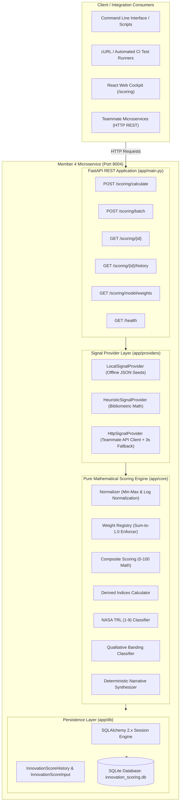
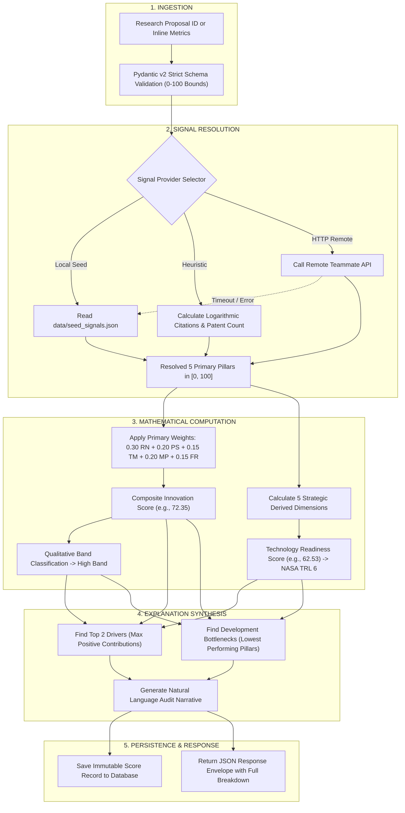
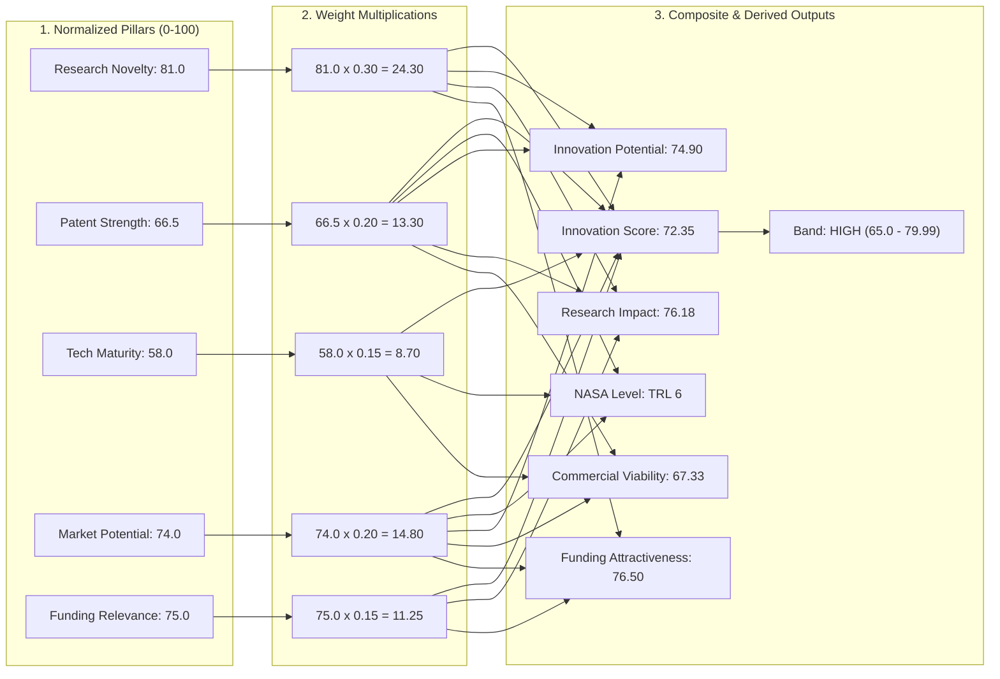
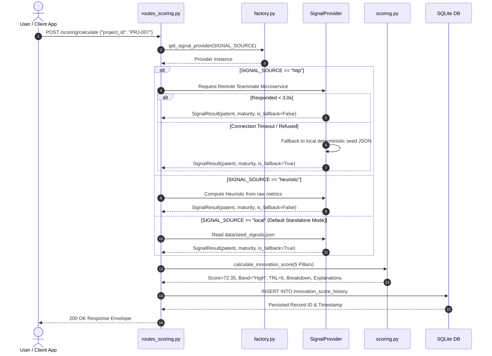
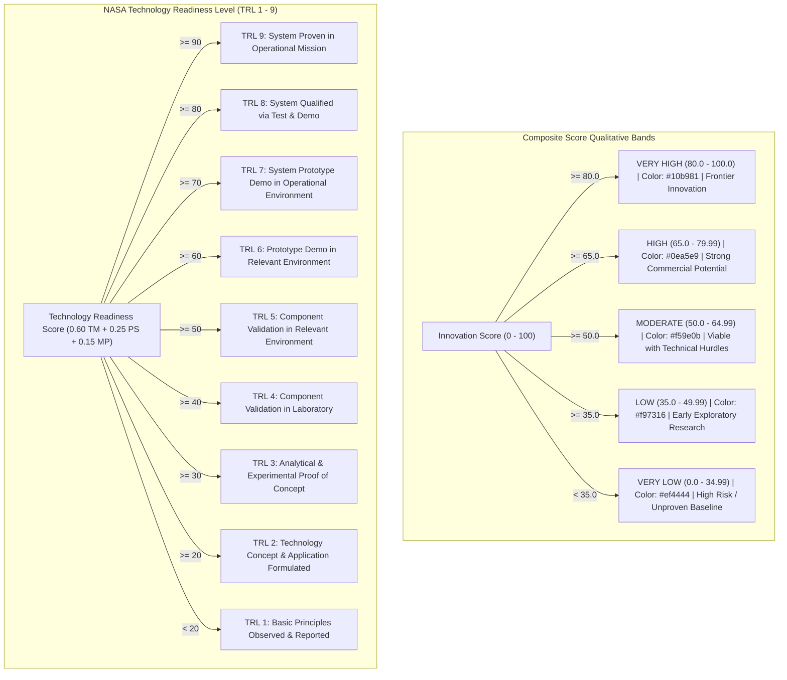
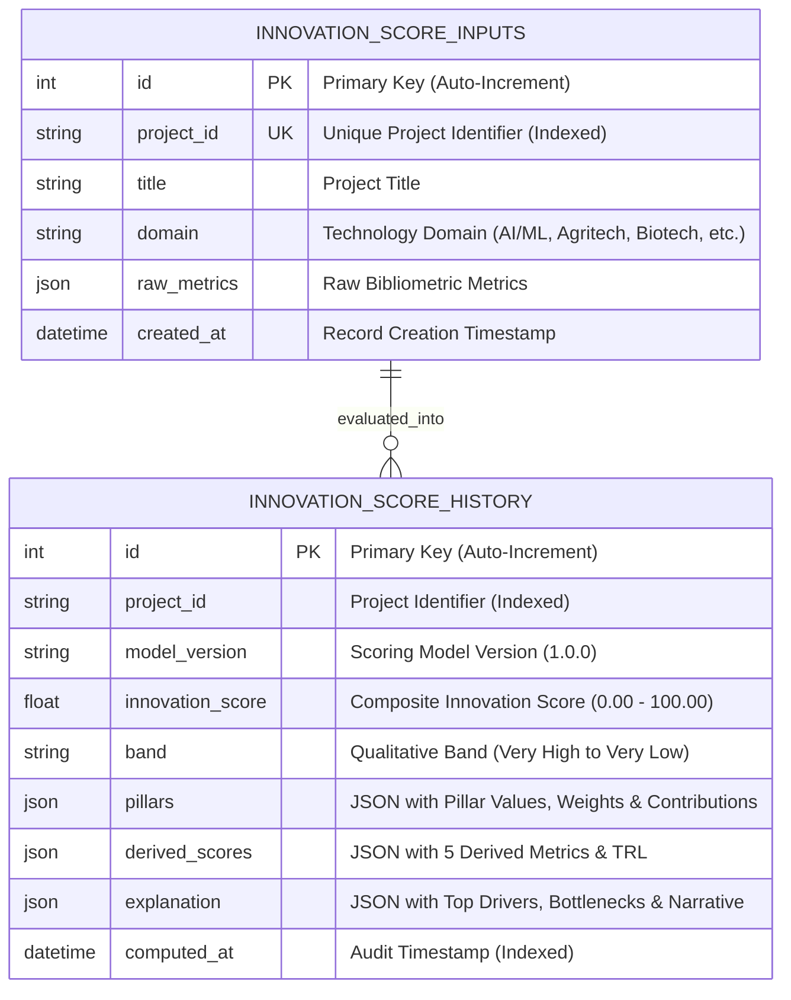

# Member 4: Standalone Innovation Scoring Intelligence Engine
**Milestone 3 — Research Funding & Innovation Intelligence Platform**

---

## 🎯 1. Executive Summary & Microservice Boundary

Member 4 is an **autonomous intelligence engine** designed to evaluate deep-tech research proposals across scientific, patent, readiness, market, and funding dimensions.

### Isolated Microservice Architecture Diagram



---

## 🧠 2. End-to-End Scoring Intelligence Lifecycle



---

## 📐 3. Mathematical Formula & Step-by-Step Numerical Walkthrough

### Mathematical Equations

$$\text{Innovation Score} = \sum_{i=1}^{5} \left( w_i \times P_i \right) = (0.30 \cdot \text{RN}) + (0.20 \cdot \text{PS}) + (0.15 \cdot \text{TM}) + (0.20 \cdot \text{MP}) + (0.15 \cdot \text{FR})$$

$$\text{Innovation Potential} = 0.45 \cdot \text{RN} + 0.30 \cdot \text{PS} + 0.25 \cdot \text{MP}$$

$$\text{Research Impact} = 0.55 \cdot \text{RN} + 0.25 \cdot \text{PS} + 0.20 \cdot \text{FR}$$

$$\text{Technology Readiness Score} = 0.60 \cdot \text{TM} + 0.25 \cdot \text{PS} + 0.15 \cdot \text{MP}$$

$$\text{Commercial Viability} = 0.45 \cdot \text{MP} + 0.30 \cdot \text{TM} + 0.25 \cdot \text{PS}$$

$$\text{Funding Attractiveness} = 0.40 \cdot \text{FR} + 0.30 \cdot \text{RN} + 0.30 \cdot \text{MP}$$

---

### Step-by-Step Numerical Verification on `PRJ-007` (Soil Microbiome Regeneration)



---

## 🔬 4. Signal Provider Strategy & Fallback Architecture



---

## 📊 5. Qualitative Bands & NASA TRL Scale Decision Tree



---

## 🗄️ 6. Database Entity Relationship (ER) Model



---

## 🚀 7. Step-by-Step Standalone Execution Guide

### 1. Run All PyTest Cases with Coverage (27/27 Passing)
```bash
cd innovation-scoring-service
pytest tests/ -v --cov=app/core
```

### 2. Seed SQLite Database with 25 Benchmark Projects
```bash
python scripts/seed_db.py
```

### 3. Launch Standalone Microservice on Port 8004
```bash
uvicorn app.main:app --host 127.0.0.1 --port 8004 --reload
```

### 4. Interactive Live Endpoints
- **Interactive Swagger UI**: [http://localhost:8004/docs](http://localhost:8004/docs)
- **Health Check**: [http://localhost:8004/health](http://localhost:8004/health)
- **Calculate Score via cURL**:
```bash
curl -X POST "http://localhost:8004/scoring/calculate" \
     -H "Content-Type: application/json" \
     -d '{"project_id": "PRJ-007"}'
```
