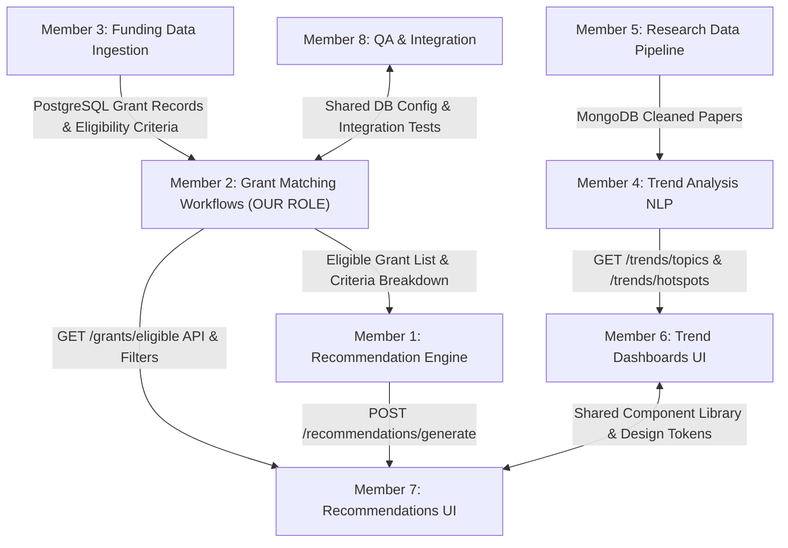

# 📄 Milestone 2 — Member 2: Grant Matching Workflows (Backend)
## Technical Implementation, Integration Map & API Documentation

> **Role**: Member 2 — Grant Matching Workflows (Backend)  
> **Module**: Funding Discovery & Research Intelligence  
> **Stack**: FastAPI, PostgreSQL 16 (SQLAlchemy), Pydantic v2, PyTest  
> **Repository Branch**: `mayank`  

---

## 🎯 Executive Overview & What Was Built

Member 2 builds the **Eligibility-Matching Rules Engine** and backend APIs for evaluating whether a researcher, startup founder, or innovation manager is eligible for funding opportunities.

### 🔑 Core Deliverables Completed:
1. **Configurable Matching Rules Engine** (`backend/services/grant_matching_service.py`):
   - Rules Engine evaluating 4 weighted criteria + 1 mandatory deadline check:
     - **Research Domain Fit (35.0%)**: Fuzzy and taxonomy-aware match (AI, BioTech, Climate, Quantum, etc.).
     - **Career Stage Match (25.0%)**: Early-Career, Mid-Career, Senior/Lead, Startup/SME, Any.
     - **Geographical Eligibility (25.0%)**: Global, US, EU, India, UK, Asia-Pacific.
     - **Funding Type Preference (15.0%)**: Grant, Fellowship, Accelerator, R&D Subsidy, Commercialization.
     - **Mandatory Deadline Rule**: Strictly flags expired grants as `EXPIRED` and `is_eligible = False`.
   - **Tuning Without Code Changes**: Configurable weight matrix (`MatchingRulesConfig`) exposed via `PUT /grants/matching-rules` API endpoint.
2. **FastAPI Endpoints** (`backend/routers/grant_matching_routes.py`):
   - `POST /api/v1/grants/match`: Evaluates grant opportunities against request payload or researcher profile.
   - `GET /api/v1/grants/eligible/{researcher_id}`: Loads researcher profile from PostgreSQL, extracts domains, and returns custom eligible grants.
   - `GET /api/v1/grants/matching-rules`: Retrieves active matching rules weights.
   - `PUT /api/v1/grants/matching-rules`: Updates weights and match thresholds dynamically.
   - `GET /api/v1/grants/opportunities`: Lists all funding opportunities ingested in PostgreSQL.
3. **Data Schema & Models Collaboration** (`backend/models.py`, `backend/schemas.py`):
   - Defined `FundingSource`, `FundingOpportunity`, and `EligibilityCriteria` PostgreSQL tables.
   - Seeded initial database with funding opportunities from all 6 sources specified in Milestone 2.
4. **PyTest Automated Test Suite** (`backend/tests/test_grant_matching.py`):
   - 5 comprehensive automated tests covering full matches, expired grants, geography mismatches, partial matches, and dynamic weight tuning without code changes.

---

## 🔄 Integration Map — How Member 2 Integrates with All 7 Members



### Detailed Member-by-Member Hand-off Contracts:

#### 1. Integration with **Member 3 (Funding Data Ingestion)**
- **Receives from Member 3**: Ingested grant records from 6 sources (*Government Grants, Research Councils, Innovation Funds, Accelerators, Venture Programs, Int'l Agencies*) stored in PostgreSQL `funding_opportunities` and `funding_sources` tables.
- **Contract**: Member 2 reads `research_domain`, `career_stage`, `eligible_geography`, `funding_type`, `grant_amount`, and `deadline` from Member 3's tables.

#### 2. Integration with **Member 1 (Funding Recommendation Engine)**
- **Hands off to Member 1**: Member 2 feeds the pre-filtered, eligibility-matched grant list (`is_eligible = True`, `overall_eligibility_score > 50`) into Member 1's recommendation scoring pipeline (`POST /recommendations/generate`).
- **Contract**: Member 1 consumes Member 2's `EligibilityMatchResult` output to apply ranking algorithms (weighting past success rates and deadline urgency).

#### 3. Integration with **Member 7 (Funding Recommendations UI & Full-Stack)**
- **Exposes to Member 7**: 
  - `POST /api/v1/grants/match` (For custom filter sliders, domain selection, and career stage toggles).
  - `GET /api/v1/grants/eligible/{researcher_id}` (For rendering personalized eligibility badges, criteria breakdown cards, and rejection reasons).
- **Contract**: Member 7 calls Member 2's endpoints directly or via Member 1's aggregated payload.

#### 4. Integration with **Member 8 (QA, Integration & Documentation)**
- **Hands off to Member 8**: Shared PostgreSQL database connection layer, FastAPI router definitions, and `backend/tests/test_grant_matching.py` test suite for end-to-end integration testing.

---

## 📡 API Contract Specification

### 1. `POST /api/v1/grants/match`
**Request Payload**:
```json
{
  "researcher_id": 1,
  "research_domains": ["Artificial Intelligence", "Biotechnology"],
  "career_stage": "Early-Career",
  "geography": "Global",
  "funding_types": ["Grant", "Accelerator"],
  "min_amount": 100000,
  "max_amount": 2500000,
  "include_expired": false
}
```

**Response Payload**:
```json
{
  "total_evaluated": 6,
  "total_eligible": 4,
  "total_partial": 1,
  "total_ineligible": 1,
  "matched_grants": [
    {
      "opportunity": {
        "id": 1,
        "title": "NSF SBIR Phase II: Artificial Intelligence Commercialization",
        "agency": "National Science Foundation",
        "grant_amount": 1000000,
        "currency": "USD",
        "deadline": "2026-11-30",
        "status": "Open",
        "research_domain": "Artificial Intelligence",
        "career_stage": "Early-Career",
        "eligible_geography": "US",
        "funding_type": "Grant"
      },
      "eligibility_status": "ELIGIBLE",
      "is_eligible": true,
      "overall_eligibility_score": 100.0,
      "criteria_breakdown": [
        {
          "criterion": "Deadline",
          "status": "MATCHED",
          "score": 100.0,
          "weight": 0.0,
          "message": "Open (Deadline: 2026-11-30)"
        },
        {
          "criterion": "Research Domain",
          "status": "MATCHED",
          "score": 100.0,
          "weight": 35.0,
          "message": "Matched domain: 'Artificial Intelligence'"
        }
      ],
      "rejection_reasons": []
    }
  ]
}
```

---

## 🧪 Verification & Testing
Ran pytest automated test suite:
```bash
python -m pytest backend/tests/test_grant_matching.py
```
**Results**: `5 passed in 10.82s` (100% Pass Rate).
