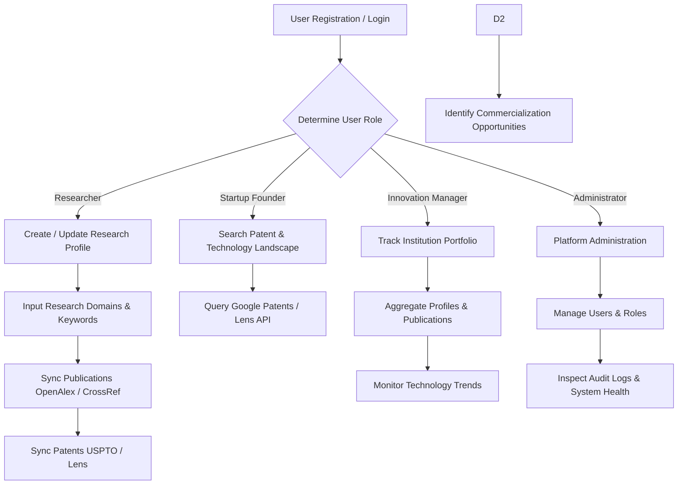

# ResearchSphere AI - Project Planning & Innovation Intelligence Workflows

## 1. Purpose
**ResearchSphere AI** is an enterprise-grade AI-Powered Research Funding & Innovation Intelligence Platform. It bridges the gap between academic research, intellectual property (patents), technology trends, and funding opportunities. By aggregating metadata from open academic repositories, patent databases, and funding agencies, the platform empowers researchers, startup founders, innovation managers, and institutional administrators to accelerate technology commercialization and secure strategic funding.

---

## 2. Problem Statement
Academic institutions, R&D labs, and tech startups struggle with fragmented data landscapes:
- **Disjointed Repositories**: Research publications (OpenAlex, CrossRef, Semantic Scholar) and patent records (USPTO, Google Patents, The Lens) reside in isolated silos.
- **Manual Funding Discovery**: Identifying relevant grant opportunities, venture funding, or government research programs requires manual, time-consuming searches.
- **Opacity in Technology Readiness**: Evaluating whether early-stage research is ready for commercialization or licensing is subjective and unstructured.
- **Lack of Strategic Innovation Intelligence**: Organizations lack real-time visibility into emerging technology trends, patent white spaces, and competitor landscapes.

---

## 3. Solution
ResearchSphere AI provides a unified intelligence engine:
- **Centralized Data Aggregation**: Connects OpenAlex, CrossRef, Semantic Scholar, USPTO, Google Patents, and The Lens into a unified data model.
- **Automated Research Profiles**: Auto-populates researcher domain interests, publications, patents, and technology keywords.
- **Intelligent Funding Matching**: Matches research capabilities and patent assets with funding programs and grants.
- **Role-Based Workflows**: Tailored dashboard experiences for Researchers, Startup Founders, Innovation Managers, and System Administrators.

---

## 4. Objectives
- **Milestone 1 Objectives**: Establish project foundation, database schema (Relational PostgreSQL + Document MongoDB), FastAPI REST backend, React + Vite frontend, JWT authentication & RBAC, research profile management, multi-source publication/patent dataset services, Docker orchestration, and developer documentation.
- **Scalability**: Support enterprise multi-tenancy and high-throughput API caching.
- **Data Integrity**: Provide strict schema validation via Pydantic v2 and SQLAlchemy ORM models with explicit foreign key constraints.

---

## 5. User Roles
The system enforces Role-Based Access Control (RBAC) across four core user personas:

| Role | Target Persona | Key Responsibilities & Capabilities |
| :--- | :--- | :--- |
| **Researcher** | Academic & Industry Scientists, Professors, PhDs | Create research profile, link publications/patents, discover matching grants, track citation impact. |
| **Startup Founder** | Tech Entrepreneurs, DeepTech Founders | Search patent landscapes, identify licensing opportunities, track commercialization viability. |
| **Innovation Manager** | University Tech Transfer Offices (TTO), R&D Directors | Portfolio analytics, innovation pipeline tracking, technology trend monitoring, funding management. |
| **Administrator** | IT Operations, Platform Admins | User lifecycle management, RBAC enforcement, audit log auditing, system metrics monitoring. |

---

## 6. Functional Requirements
1. **Authentication & Security**: User registration, login, JWT token issuance, bcrypt password hashing, and role-based route protection.
2. **Profile Management**: CRUD operations for research domains, technology keywords, publication lists, patent references, and organization affiliation.
3. **Dataset Integration Service**: Real-time connectors and caching layer for OpenAlex, CrossRef, Semantic Scholar, USPTO Public Data, Google Patents, and The Lens.
4. **Dashboard & Navigation**: Role-specific dashboards showing profile metrics, dataset activity, and platform status.
5. **System Auditing & Notifications**: Logging system operations and delivering user notification updates.

---

## 7. Non-Functional Requirements
- **Performance**: Sub-200ms API response latency for cached dataset queries.
- **Security**: OAuth2 Bearer token standard, CORS restriction, SQL injection prevention via SQLAlchemy ORM, XSS mitigation on frontend.
- **Reliability & Availability**: Containerized resilience via Docker Compose healthchecks for PostgreSQL and MongoDB.
- **Maintainability**: Clean repository/service layer pattern in backend and modular component structure in frontend.

---

## 8. Innovation Intelligence Workflows

---

## Educational Breakdown

### 1. What was created
- Documented the foundational purpose, problem statement, business goals, role definitions, functional/non-functional requirements, and workflow diagram for ResearchSphere AI.

### 2. Why it is needed
- Enterprise platforms require a clear blueprint before writing code to align stakeholders, developers, and architects on business objectives and system boundaries.

### 3. How it works
- Establishes functional requirements and role mappings that directly determine database tables, API security guards, and UI navigation routes.

### 4. Which files were added
- [`docs/PROJECT_PLANNING.md`](file:///c:/Users/mayan/OneDrive/Documents/GitHub/InnovaFund-AI/docs/PROJECT_PLANNING.md)

### 5. How to run it
- View directly in markdown viewer or render via GitHub/VS Code preview.

### 6. Industry best practices
- Define clear user personas and boundaries early. Use standard UML/Mermaid state workflows.

### 7. Common mistakes to avoid
- Skipping role definition lead to hardcoded permission checks scattered throughout UI/API code.
