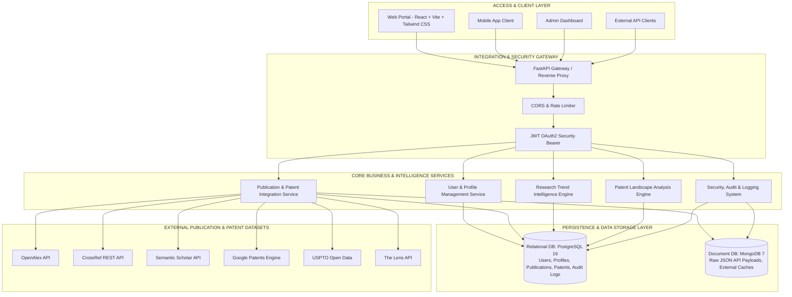

# ResearchSphere AI - Complete System Architecture

## 1. High-Level Architecture Diagram

---

## 2. Component Explanations

### Frontend Layer
- **Tech Stack**: React 18, Next.js / Vite React, Tailwind CSS, Lucide React Icons.
- **Responsibilities**: Renders responsive UI wireframes, handles routing via React Router DOM, manages AuthContext for JWT tokens, renders interactive dashboards, profile managers, publication searchers, and patent browsers.

### Backend Layer
- **Tech Stack**: Python 3.11+, FastAPI, Uvicorn ASGI server.
- **Responsibilities**: RESTful endpoints, asynchronous request handling, OpenAPI/Swagger documentation, dependency injection for database sessions and current authenticated user.

### Authentication & Authorization
- **Security Engine**: JWT (JSON Web Tokens) encoded with HS256 algorithm and bcrypt password hashing via Passlib.
- **RBAC Guard**: Custom `require_role("administrator", "researcher", ...)` FastAPI dependency decorator to protect routes based on role claims stored in the JWT payload.

### Business Layer (Services & Repositories)
- **Repository Pattern**: Decouples data access (SQLAlchemy ORM queries) from business logic.
- **Services**:
  - `AuthService`: Registration, token generation, user validation.
  - `ProfileService`: Aggregates profile info, research domain mapping, and keyword lists.
  - `DatasetService`: Unified connector fetching and transforming data from OpenAlex, CrossRef, Semantic Scholar, USPTO, Google Patents, and The Lens.

### Database Layer (Hybrid Relational + Document Architecture)
- **PostgreSQL 16**: Primary relational database for structured entities requiring ACID compliance (Users, Roles, Profiles, Interests, Publications, Patents, Organizations, Keywords, Sessions, Audit Logs, Notifications).
- **MongoDB 7**: Document store for un-normalized raw JSON payloads retrieved from external APIs and cache management.

### External Datasets & APIs
- **Publications**: OpenAlex (open bibliometric data), CrossRef (DOI metadata), Semantic Scholar (scientific literature).
- **Patents**: USPTO Public Data, Google Patents, The Lens (global patent and scholarly work mapping).

### Future AI Layer
- Modular hooks designed to integrate Scikit-learn, Sentence-Transformers, Vector DBs (FAISS/Pinecone), and LLM recommendation scoring in subsequent project milestones.

### Cloud & DevOps Infrastructure
- **Docker Compose**: Containerized execution environment orchestrating FastAPI backend, React frontend, PostgreSQL 16, and MongoDB 7.

### Monitoring & Logging
- **Structured Audit Logs**: Every critical system action (user login, profile update, dataset sync) generates an AuditLog entry recorded in PostgreSQL and MongoDB.

---

## Educational Breakdown

### 1. What was created
- Designed the complete system architecture diagram using Mermaid and documented component responsibilities across Frontend, Backend, Authentication, Business Layer, Database, External APIs, Future AI Layer, Cloud Infrastructure, Monitoring, and Logging.

### 2. Why it is needed
- Architectural clarity ensures scalability, modular code organization, clear separation of concerns (Layered Repository/Service pattern), and hybrid database design choices.

### 3. How it works
- Client requests flow through the Security Gateway (CORS + JWT Auth), reaching business services that interact with PostgreSQL ORM repositories, MongoDB cache stores, and external academic/patent REST APIs.

### 4. Which files were added
- [`docs/SYSTEM_ARCHITECTURE.md`](file:///c:/Users/mayan/OneDrive/Documents/GitHub/InnovaFund-AI/docs/SYSTEM_ARCHITECTURE.md)

### 5. How to run it
- Open with markdown previewer or view inside developer documentation.

### 6. Industry best practices
- Decouple API handlers from ORM database logic via repository/service pattern; use hybrid DBs for structured relational models vs unstructured raw external JSON APIs.

### 7. Common mistakes to avoid
- Coupling UI directly to raw database queries or executing external HTTP calls directly inside controller route handlers without background caching.
